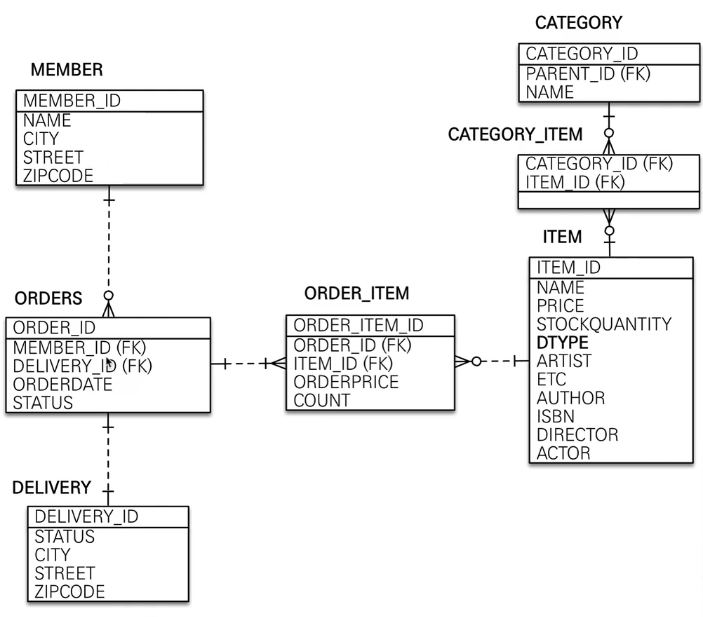
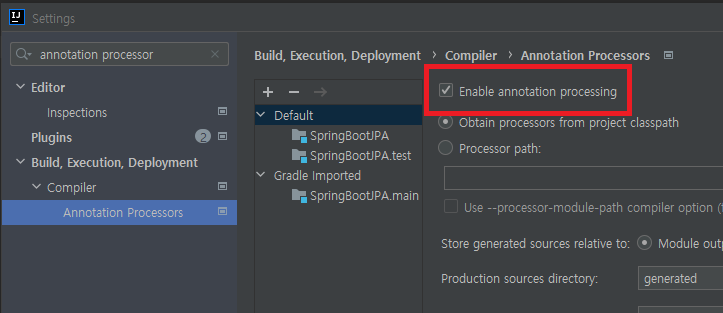
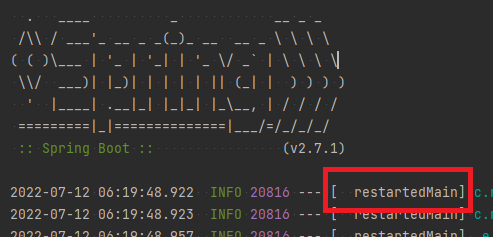
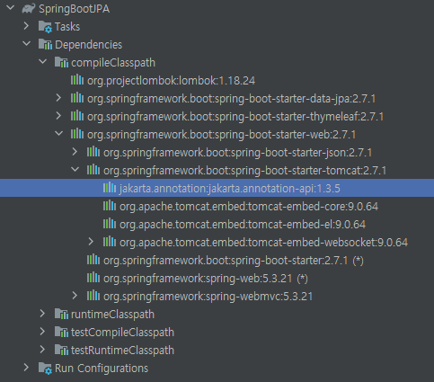

# SpringBoot JPA
- [인프런 - 김영한 - 실전! 스프링 부트와 JPA 활용1](https://www.inflearn.com/course/%EC%8A%A4%ED%94%84%EB%A7%81%EB%B6%80%ED%8A%B8-JPA-%ED%99%9C%EC%9A%A9-1)

## 목표
- JPA와 SpringBoot를 접목시킨 웹 어플리케이션 개발 방법 복습
- Swagger를 통한 통합 테스트 환경 복습
- DDD 개발법 학습
  

## Stack


## 1. 특이사항
- Lombok 사용 시 Intellij IDEA 설정에서 반드시 Enable annotation processing을 활성화 시켜주어야 한다.
  
- Springboot 2 부터 Connection Pool은 Hikari를 기본으로 사용된다.
- slf4j는 로그 인터페이스 모음이며, 구현체로 logback, log4j, log4j2 등이 있다.

### 1.1. Thymeleaf
#### 특징
- 스프링과 연동되는 기능이 많으며, 스프링에서 전폭적으로 지원해주는 서버 사이드 뷰 엔진이다.
- 자연스러운 템플릿으로 JSP처럼 기존의 HTML의 형식을 깨지 않는다.
```html
<!-- JSP -->
<thead>
<tr>
  <c:if test="${msgs.product.name ne null}">
    <th th:text="msgs.product.name">name</th>
    <th th:text="msgs.product.value">value</th>
  </c:if>
</tr>
</thead>
```
```html
<!-- Thymeleaf -->
<thead>
<tr>
  <th th:text="#{msgs.product.name}">name</th>
  <th th:text="#{msgs.product.value}">value</th>
</tr>
</thead>
```
- Thymeleaf 3.0 이전의 경우는 성능상 이슈가 존재한다.
- Thymeleaf 3.0 이전에서는 태그가 완전히 닫혀야지만 인식되는 문제가 존재한다.
```html
<!-- ERROR -->
<br>
```
```html
<!-- SUCCESS -->
<br/>
```

### 1.2. Springboot DevTools
- ```build.gradle```에 해당 의존성을 추가하면 뷰 파일 수정 시 매 번 재기동해이햐는 번거로움을 덜 수 있다.
```
dependencies {
  ...
  implementation 'org.springframework.boot:spring-boot-starter-web'
  implementation 'org.springframework.boot:spring-boot-devtools'
  compileOnly 'org.projectlombok:lombok'
  ...
}
```
- 해당 의존성 추가 후 부터는 뷰 파일 수정 후 재기동 없이 해당 파일을 리컴파일 하면 정상적으로 반영된다. (Ctrl+Shift+F9)
- springboot 기동 시 아래 이미지처럼 restartedMain 문구가 뜨면 정상 적용된 것이다.
  

### 1.3. Gradle 라이브러리 의존성 확인 방법
- intelliJ IDEA 사용 시 Gradle 탭의 dependencies를 통해 확인할 수 있다.

- 터미널에서 프로젝트 홈 경로에 있는 ```gradlew ```를 실행해주면 의존성을 확인할 수 있다.
```shell
user$ ./gradlew dependencies
```
```
> Task :dependencies

------------------------------------------------------------
Root project 'SpringBootJPA'
------------------------------------------------------------

annotationProcessor - Annotation processors and their dependencies for source set 'main'.
\--- org.projectlombok:lombok -> 1.18.24

apiElements - API elements for main. (n)
No dependencies

archives - Configuration for archive artifacts. (n)
No dependencies

bootArchives - Configuration for Spring Boot archive artifacts. (n)
No dependencies

compileClasspath - Compile classpath for source set 'main'.
+--- org.projectlombok:lombok -> 1.18.24
+--- org.springframework.boot:spring-boot-starter-data-jpa -> 2.7.1
|    +--- org.springframework.boot:spring-boot-starter-aop:2.7.1
|    |    +--- org.springframework.boot:spring-boot-starter:2.7.1
|    |    |    +--- org.springframework.boot:spring-boot:2.7.1
|    |    |    |    +--- org.springframework:spring-core:5.3.21
|    |    |    |    |    \--- org.springframework:spring-jcl:5.3.21
|    |    |    |    \--- org.springframework:spring-context:5.3.21
...
...
...
```

## 2. 테스트
### 2.1. ```@Rollback(false)```
- ```@Transactional``` 어노테이션 사용 시 테스트 환경에서 트랜잭션 의존성 주입을 받는데, 테스트 종료 후 강제로 롤백을 수행하기 때문에 직접 데이터베이스에 적용된 것을 확인하고 싶으면 해당 롤백 어노테이션을 사용하여 수동으로 제어해야 한다.
```java
@Test
@Transactional
@Rollback(false)
void test(){
  // TODO --> do something
}
```

### 2.2. 쿼리 파라미터 출력하기
- application.yml 파일에 ```logging:level:org.hibernate.type : trace``` 프로퍼티를 추가하면 로그 라인으로 파라미터 바인딩이 출력된다.
```yaml
### application.yml
logging:
  level:
    org.hibernate.type : trace
``` 
- [스프링 부트 데코레이터](https://github.com/gavlyukovskiy/spring-boot-data-source-decorator) 를 사용하여 SQL에 직접 바인딩된 파라미터 값을 로그로 출력할 수 있다.
```
// build.gradle
// p6spy
implementation("com.github.gavlyukovskiy:p6spy-spring-boot-starter:1.8.0")
```
```
2022-07-18 22:31:23.515 TRACE 15988 --- [    Test worker] o.h.type.descriptor.sql.BasicBinder      : binding parameter [1] as [TIMESTAMP] - [2022-07-18T22:31:23.455165300]
2022-07-18 22:31:23.516 TRACE 15988 --- [    Test worker] o.h.type.descriptor.sql.BasicBinder      : binding parameter [2] as [VARCHAR] - [user01]
2022-07-18 22:31:23.517 TRACE 15988 --- [    Test worker] o.h.type.descriptor.sql.BasicBinder      : binding parameter [3] as [BIGINT] - [1]
2022-07-18 22:31:23.519  INFO 15988 --- [    Test worker] p6spy                                    : #1658151083519 | took 0ms | statement | connection 3| url jdbc:h2:tcp://localhost/~/springbootjpa
insert into member (add_time, name, id) values (?, ?, ?)
insert into member (add_time, name, id) values ('2022-07-18T22:31:23.455+0900', 'user01', 1);
2022-07-18 22:31:23.522  INFO 15988 --- [    Test worker] p6spy                                    : #1658151083522 | took 0ms | commit | connection 3| url jdbc:h2:tcp://localhost/~/springbootjpa
```


## 3. Gradle
### 3.1. Gradle 빌드
- ```./gradlew [clean] build``` 명령어를 쉘 커맨드에 입력 시 테스트가 통과되면 ```./build/libs```에 결과물을 출력한다.
- 배포 파일 확장자(jar, war) 설정은 build.gradle 에 해당 라인을 추가하여 변경한다.
```
plugins {
  id 'org.springframework.boot' version '2.7.1'
  id 'io.spring.dependency-management' version '1.0.11.RELEASE'
  id 'java'
  id 'war'  // plubins id 추가
}

group = 'com.roman14'
version = '0.0.1-SNAPSHOT'
sourceCompatibility = '11'
apply plugin: 'war' // plubin 'war' 적용
```

## 4. 스프링부트
### 4.1. SpringPhysicalNamingStrategy
- 테이블명, 필드명 등의 규칙 전략을 가지는 스프링의 클래스.
- 구 hibernate의 경우 필드명 그대로 테이블과 필드명을 생성하였다.
- 해당 클래스가 테이블, 명치의 규칙에서 최우선시 된다. 즉 특정 사유로 명칭의 규칙을 변경하고 싶다면 해당 클래스를 참고하면 된다.
```yaml
########### application.yml ############
# 논리명
spring.jpa.hibernate.naming.implicit-strategy: org.springframework.boot.orm.jpa.hibernate.SpringImplicitNamingStrategy

# 물리명
spring.jpa.hibernate.naming.physical-strategy: org.springframework.boot.orm.jpa.hibernate.SpringPhysicalNamingStrategy
```

### 4.2. 엔티티 매니저 의존성 주입
- 엔티티 매니저 의존성 주입은 Repository 레벨에서 ```@PersistenceContext``` 어노테이션을 통해 주입받을 수 있다.
```java
@Repository
public class MemberRepository
{
  @PersistenceContext
  private EntityManager em;
}
```
- 엔티티 매니저 팩토리의 의존성을 주입받고 싶다면 Repository 레벨에서 ```@PersistenceUnit``` 어노테이션을 통해 주입받을 수 있다.
```java
@Repository
public class MemberRepository
{
  @PersistenceUnit
  private EntityManagerFactory emf;
}
```