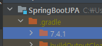

# SpringBoot JPA
- [인프런 - 김영한 - 실전! 스프링 부트와 JPA 활용1](https://www.inflearn.com/course/%EC%8A%A4%ED%94%84%EB%A7%81%EB%B6%80%ED%8A%B8-JPA-%ED%99%9C%EC%9A%A9-1)

## 목표
- JPA와 SpringBoot를 접목시킨 웹 어플리케이션 개발 방법 복습
- Swagger를 통한 통합 테스트 환경 복습
- 핵심 요약
- DDD 개발법 학습
  

## Stack


## 1. 특이사항
- Lombok 사용 시 Intellij IDEA 설정에서 반드시 Enable annotation processing을 활성화 시켜주어야 한다.
  
- Springboot 2 부터 Connection Pool은 Hikari를 기본으로 사용된다.
- slf4j는 로그 인터페이스 모음이며, 구현체로 logback, log4j, log4j2 등이 있다.

### 1.1. Thymeleaf
#### 특징
- 스프링과 연동되는 기능이 많으며, 스프링에서 전폭적으로 지원해주는 서버 사이드 뷰 엔진이다.
- 자연스러운 템플릿으로 JSP처럼 기존의 HTML의 형식을 깨지 않는다.
```html
<!-- JSP -->
<thead>
<tr>
  <c:if test="${msgs.product.name ne null}">
    <th th:text="msgs.product.name">name</th>
    <th th:text="msgs.product.value">value</th>
  </c:if>
</tr>
</thead>
```
```html
<!-- Thymeleaf -->
<thead>
<tr>
  <th th:text="#{msgs.product.name}">name</th>
  <th th:text="#{msgs.product.value}">value</th>
</tr>
</thead>
```
- Thymeleaf 3.0 이전의 경우는 성능상 이슈가 존재한다.
- Thymeleaf 3.0 이전에서는 태그가 완전히 닫혀야지만 인식되는 문제가 존재한다.
```html
<!-- ERROR -->
<br>
```
```html
<!-- SUCCESS -->
<br/>
```

---

### 1.2. Springboot DevTools
- ```build.gradle```에 해당 의존성을 추가하면 뷰 파일 수정 시 매 번 재기동해이햐는 번거로움을 덜 수 있다.
```
dependencies {
  ...
  implementation 'org.springframework.boot:spring-boot-starter-web'
  implementation 'org.springframework.boot:spring-boot-devtools'
  compileOnly 'org.projectlombok:lombok'
  ...
}
```
- 해당 의존성 추가 후 부터는 뷰 파일 수정 후 재기동 없이 해당 파일을 리컴파일 하면 정상적으로 반영된다. (Ctrl+Shift+F9)
- springboot 기동 시 아래 이미지처럼 restartedMain 문구가 뜨면 정상 적용된 것이다.
  

### 1.3. Gradle 라이브러리 의존성 확인 방법
- intelliJ IDEA 사용 시 Gradle 탭의 dependencies를 통해 확인할 수 있다.

- 터미널에서 프로젝트 홈 경로에 있는 ```gradlew ```를 실행해주면 의존성을 확인할 수 있다.
```shell
user$ ./gradlew dependencies
```
```
> Task :dependencies

------------------------------------------------------------
Root project 'SpringBootJPA'
------------------------------------------------------------

annotationProcessor - Annotation processors and their dependencies for source set 'main'.
\--- org.projectlombok:lombok -> 1.18.24

apiElements - API elements for main. (n)
No dependencies

archives - Configuration for archive artifacts. (n)
No dependencies

bootArchives - Configuration for Spring Boot archive artifacts. (n)
No dependencies

compileClasspath - Compile classpath for source set 'main'.
+--- org.projectlombok:lombok -> 1.18.24
+--- org.springframework.boot:spring-boot-starter-data-jpa -> 2.7.1
|    +--- org.springframework.boot:spring-boot-starter-aop:2.7.1
|    |    +--- org.springframework.boot:spring-boot-starter:2.7.1
|    |    |    +--- org.springframework.boot:spring-boot:2.7.1
|    |    |    |    +--- org.springframework:spring-core:5.3.21
|    |    |    |    |    \--- org.springframework:spring-jcl:5.3.21
|    |    |    |    \--- org.springframework:spring-context:5.3.21
...
...
...
```

## 2. 테스트
### 2.1. ```@Rollback(false)```
- ```@Transactional``` 어노테이션 사용 시 테스트 환경에서 트랜잭션 의존성 주입을 받는데, 테스트 종료 후 강제로 롤백을 수행하기 때문에 직접 데이터베이스에 적용된 것을 확인하고 싶으면 해당 롤백 어노테이션을 사용하여 수동으로 제어해야 한다.
```java
@Test
@Transactional
@Rollback(false)
void test(){
  // TODO --> do something
}
```

---

### 2.2. 쿼리 파라미터 출력하기
- application.yml 파일에 ```logging:level:org.hibernate.type : trace``` 프로퍼티를 추가하면 로그 라인으로 파라미터 바인딩이 출력된다.
```yaml
### application.yml
logging:
  level:
    org.hibernate.type : trace
``` 
- [스프링 부트 데코레이터](https://github.com/gavlyukovskiy/spring-boot-data-source-decorator) 를 사용하여 SQL에 직접 바인딩된 파라미터 값을 로그로 출력할 수 있다.
```
// build.gradle
// p6spy
implementation("com.github.gavlyukovskiy:p6spy-spring-boot-starter:1.8.0")
```
```
2022-07-18 22:31:23.515 TRACE 15988 --- [    Test worker] o.h.type.descriptor.sql.BasicBinder      : binding parameter [1] as [TIMESTAMP] - [2022-07-18T22:31:23.455165300]
2022-07-18 22:31:23.516 TRACE 15988 --- [    Test worker] o.h.type.descriptor.sql.BasicBinder      : binding parameter [2] as [VARCHAR] - [user01]
2022-07-18 22:31:23.517 TRACE 15988 --- [    Test worker] o.h.type.descriptor.sql.BasicBinder      : binding parameter [3] as [BIGINT] - [1]
2022-07-18 22:31:23.519  INFO 15988 --- [    Test worker] p6spy                                    : #1658151083519 | took 0ms | statement | connection 3| url jdbc:h2:tcp://localhost/~/springbootjpa
insert into member (add_time, name, id) values (?, ?, ?)
insert into member (add_time, name, id) values ('2022-07-18T22:31:23.455+0900', 'user01', 1);
2022-07-18 22:31:23.522  INFO 15988 --- [    Test worker] p6spy                                    : #1658151083522 | took 0ms | commit | connection 3| url jdbc:h2:tcp://localhost/~/springbootjpa
```


## 3. Gradle
### 3.1. Gradle 빌드
- ```./gradlew [clean] build``` 명령어를 쉘 커맨드에 입력 시 테스트가 통과되면 ```./build/libs```에 결과물을 출력한다.
- 배포 파일 확장자(jar, war) 설정은 build.gradle 에 해당 라인을 추가하여 변경한다.
```
plugins {
  id 'org.springframework.boot' version '2.7.1'
  id 'io.spring.dependency-management' version '1.0.11.RELEASE'
  id 'java'
  id 'war'  // plubins id 추가
}

group = 'com.roman14'
version = '0.0.1-SNAPSHOT'
sourceCompatibility = '11'
apply plugin: 'war' // plubin 'war' 적용
```

## 4. 스프링부트
### 4.1. SpringPhysicalNamingStrategy
- 테이블명, 필드명 등의 규칙 전략을 가지는 스프링의 클래스.
- 구 hibernate의 경우 필드명 그대로 테이블과 필드명을 생성하였다.
- 해당 클래스가 테이블, 명치의 규칙에서 최우선시 된다. 즉 특정 사유로 명칭의 규칙을 변경하고 싶다면 해당 클래스를 참고하면 된다.
```yaml
########### application.yml ############
# 논리명
spring.jpa.hibernate.naming.implicit-strategy: org.springframework.boot.orm.jpa.hibernate.SpringImplicitNamingStrategy

# 물리명
spring.jpa.hibernate.naming.physical-strategy: org.springframework.boot.orm.jpa.hibernate.SpringPhysicalNamingStrategy
```

---

### 4.2. 엔티티 매니저 의존성 주입
- 엔티티 매니저 의존성 주입은 Repository 레벨에서 ```@PersistenceContext``` 어노테이션을 통해 주입받을 수 있다.
```java
@Repository
public class MemberRepository
{
  @PersistenceContext
  private EntityManager em;
}
```
- 엔티티 매니저 팩토리의 의존성을 주입받고 싶다면 Repository 레벨에서 ```@PersistenceUnit``` 어노테이션을 통해 주입받을 수 있다.
```java
@Repository
public class MemberRepository
{
  @PersistenceUnit
  private EntityManagerFactory emf;
}
```
- 스프링 부트 JPA에서 제공하는 ```@Autowired``` 어노테이션을 통해 의존성 주입이 가능하기 때문에, 생성자를 통한 의존성 주입도 가능하다. ```Lombok```을 사용하면 더욱 편리하다.
```java
@Repository
@RequiredArgsConstructor
public class MemberRepository
{
  private final EntityManager em;
}
```

## 5. 성능최적화 팁
### 5.1. 트랜잭션 성능 최적화
- ```org.springframework.transaction.annotation.Transactional``` 어노테이션 사용하여 ```readOnly``` 옵션을 사용해 읽기 전용 메서드의 경우 더티체킹을 안하는 등 성능상 이점을 가져갈 수 있다.
- 일반적인 서비스 클래스에 ```readOnly``` 트랜잭션을 추가하여 ```public``` 메서드에 공통 적용 후, 생성, 수정, 삭제 같이 ```readOnly```가 아닌 쓰기가 일어나는 트랜잭션의 경우 별도로 ```@Transactional``` 메서드를 추가하여 편리하게 적용할 수 있다. 반대로 쓰기가 자주 일어나는 커맨드성 서비스의 경우엔 반대로 적용하면 편리하다. 
```java
@Service
@Transactional(readOnly = true)
public class MemberService
{
  // 당연하게도 생성, 수정, 삭제의 경우에 readOnliy를 활성화 하면 DB에 반영이 안된다. 그러므로 별도로 @Transactional 어노테이션을 추가해준다.
  @Transactional
  public void signUp(Member member) { repository.save(member); }
  
  // 클래스에서 이미 읽기전용 트랜잭션이 적용이 되어있기 때문에 @Transactional 어노테이션 추가를 생략한다. 
  public List<Member> findAll() { reurn new ArrayList<Member>(); }
}
```

---

### 5.2. OSIV(Open Session In View) 설정
- 기존의 JPA는 트랜잭션이 발생한 시점에서 DB 커넥션이 생성되며, 요청이 완전히 종료될 때 까지 영속성 컨텍스트를 활용하기 위해 커넥션을 유지하므로 리소스 낭비가 심한 편이다.
- 아래와 같이 설정하여 OSIV 기능을 해제할 수 있다. 해제하면 트랜잭션 범위 밖에서는 영속성 컨텍스트를 활용한 Lazy-loading, dirty-checking 등이 불가능하니 주의한다.
```yaml
spring:
  jpa:
    open-in-view: false
```

---

### 5.3. BatchSize를 통한 N+1 문제 해결

- 컬렉션을 조회할 때에 여러번 조회할 필요 없이 BatchSize를 통해 JPA에서 컬렉션을 조회할 때 쿼리에 IN 조건을 생성해서 여러 컬렉션 내용을 쿼리를 쉽게 가져오게 할 수 있다.

> - 어플리케이션 전역 설정의 경우 아래와 같이 스프링 설정 파일(yml, properties)에 정의한다.
> ```yaml
> # application.yml
> spring:
>   jpa:
>     properties:
>       hibernate:
>         default_batch_fetch_size: 30
>         jdbc:
>           batch_size: 100
> ```

> - 엔티티 별로 별도로 적용 하고 싶을 경우 ```@BatchSize``` 어노테이션을 통해 설정한다.
>
> ```java
> @Entity
> public class Test
> {
>   @BatchSize(size = 30)
>   @OneToMany(mappedBy = "test")
>   private List<TestItem> testItems;
> }
> ```

- 위 설정을 적용 하면, 컬렉션 조회에 IN 조건이 추가된 쿼리가 발생 하며, ceil(resultRows / BatchSize) + 1 갯수만큼으로 DB 요청을 획기적으로 줄일 수 있다.
> - BatchSize = 30
> - ResultRows = 220
> - 결과 : 기존 N+1의 문제를 해결하지 않았을 경우 220+1 번의 쿼리가 발생되겠지만, 총 9번의 쿼리로 성능이 개선되었다.

## 6. Spring JPA 팁
### 6.1. FETCH JOIN
```java
public class Member
{
  @ManyToOne(fetch = FetchType.LAZY)
  @JoinColumn(name = "team_id")
  private Team team;
}
public class Team
{
  @OneToMany(mappedBy = "team")
  private List<Member> memberList;
}
```
- ```@Query```의 ```FETCH JOIN```을 이용한 FETCH JOIN
```java
public interface MemberRepository extends JpaRepository<Member, Long>
{
  @Query("SELECT m FROM Member m JOIN FETCH m.team t")
  List<Member> findAllMembers();
}
```
- ```@EntityGraph```를 이용한 FETCH JOIN
```java
public interface MemberRepository extends JpaRepository<Member, Long>
{
  @EntityGraph(attributePaths = {"team"})
  List<Member> findAllMembers();
}
```
>```attributePaths```속성 값에 ```.```을 통해 그래프 탐색이 가능하다.
> ```java
> public class Team
> {
>   @ManyToOne(fetch = FetchType.LAZY)
>   @JoinColumn(name = "department_id")
>   private Department department;
> }
> 
> public interface MemberRepository extends JpaRepository<Member, Long>
> {
>   @EntityGraph(attributePaths = {"team", "team.department"})
>   List<Member> findAllMembers();
> }
> ```

---

### 6.2. 테스트
- 테스트 시 ```.../test/resources``` 디렉토리의 설정 파일을 우선적으로 읽어들인다. 
- H2 DB를 사용할 경우 URL을 통해 In-Memory 모드로 동작시키도록 사용할 수 있다.([H2 공식페이지 참조](https://h2database.com/html/cheatSheet.html))
```yaml
spring:
  datasource:
    url: jdbc:h2:mem:springbootjpa
```
- 기본적으로 yml에 DB 설정이 없다면 DB는 In-Memory 모드로 동작한다.
```yaml
###### 아래의 내용이 불필요해진다. ######
#spring:
#  datasource:
#    url: jdbc:h2:mem:springbootjpa
#    username: sa
#    password:
#    driver-class-name: org.h2.Driver
#  jpa:
#    hibernate:
#      ddl-auto: create
#      properties:
#        hibernate:
#          format_sql: true
logging:
  level:
    org-hibernate.SQL : debug
    org.hibernate.type : trace

```


## 7. 트러블슈팅

### 7.1. BatchSize가 동작하지 않을 경우

- 스프링 설정 파일이 yml로 작성된 경우 **들여쓰기**를 확인한다. #[인프런) BatchSize 가 동작하지...](https://www.inflearn.com/questions/692400) 질문글을 참고

---

### 7.2. querydsl 빌드가 되지 않는 경우
- ```Unable to load class "com.querydsl.apt.jpa.JPAAnnotationProcessor"```
- ```Unable to load class 'com.mysema.codegen.model.Type'.```
- 위 오류가 발생할 경우 gradle 버전을 확인하여 5.0 이상일 경우 설정을 추가해야한다. intelliJ idea의 경우 gradle 버전 확인 방법은 아래와 같다. <br>



- 추가해야 할 설정은 아래와 같으며 주석처리 되지 않은 부분이 핵심이다.
```groovy
buildscript {
  ext {
    queryDslVersion = "5.0.0"
  }
}

//plugins {
//  id 'org.springframework.boot' version '2.7.1'
//  id 'io.spring.dependency-management' version '1.0.11.RELEASE'
//  id 'java'
  id "com.ewerk.gradle.plugins.querydsl" version "1.0.10"
//}

//group = 'com.roman14'
//version = '0.0.1-SNAPSHOT'
//sourceCompatibility = '11'
//
//configurations {
//  compileOnly {
//    extendsFrom annotationProcessor
//  }
//}
//
//repositories {
//  mavenCentral()
//}

//dependencies {
  // ...
  // 따옴표를 조심해야한다. 작은 따옴표를 사용 할 경우 ${} 인식이 불가능하므로 오류가 발생한다.
  implementation "com.querydsl:querydsl-jpa:${queryDslVersion}"
  annotationProcessor "com.querydsl:querydsl-apt:${queryDslVersion}"
  // ...
//}

//tasks.named('test') {
//  useJUnitPlatform()
//}

def querydslDir = "$buildDir/generated/querydsl"

querydsl {
  jpa = true
  querydslSourcesDir = querydslDir
}
sourceSets {
  main.java.srcDir querydslDir
}
compileQuerydsl{
  options.annotationProcessorPath = configurations.querydsl
}

configurations {
  compileOnly {
    extendsFrom annotationProcessor
  }
  querydsl.extendsFrom compileClasspath
}
```